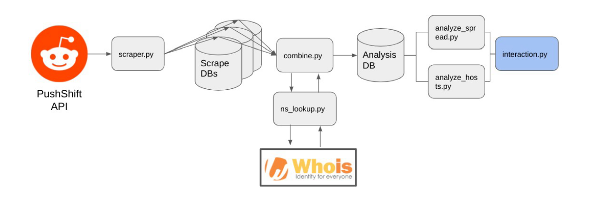

## Subreddit Analysis Project

#Outline

The online social network and link-sharing community Reddit has been lauded for their approach to content moderation on their platform – in response to toxic or borderline illegal behavior occurring within individual groups on Reddit (known as subreddits), instead of outwardly banning the users themselves, they require
users to be logged in and explicitly opt into viewing ‘shocking or highly off ensive content’. This design friction has led to a substantial decrease in new users for [at least two notable quarantined subreddits](https://arxiv.org/abs/2009.11483) (‘The_Donald’, devoted to Donald Trump, and ‘TheRedPill’, focused on broadly anti-feminist rhetoric).

The goal of our project was to investigate the impact of a Reddit ‘quarantine’ on two metrics of interest:

1. Does consolidation in webhosting diff er between quarantined subreddits and non-quarantined subreddits?
In response to Parler’s notable ‘deplatforming’ by Amazon Web Services, our group was curious how
easy it might be to remove infl ammatory content in the form of external URLs from these 
quarantined subreddits if their respective cloud hosts decided to take action. To do so, we investigated
the consolidation of webhosting on each of the subreddits that we investigated to see if more 
mainstream subreddits displayed a diff erent trend that quarantined ones.

2. Does quarantining a subreddit reduce the outward fl ow of URLs to non-quarantined subreddits?
While quarantines appear eff ective at reducing recruitment to radicalized communities, we were 
curious about whether we could observe a decrease in the frequency of URLs from quarantined 
subreddits being found on ‘adjacent’ non-quarantined subreddits after the quarantine was enacted. 

#Files
- analyze_hosts.py  - code to analyze hosting data
- analyze_spread.py - code to analyze spread to other 
- combine.py - reads scrape sql dbs and writes to analysis.db
- CS122_Project_Env.yml - Conda Environment Packages needed
- data/ - data directory used to store scraped and cleaned data
- install.sh - shell script used to set up conda environment
- interact.py - the file the user should run to interact with the program
- mmilosh-npg-tarren.pdf - report explaining the project purpose
- output/ - output directory used to store visualizations from analysis
- scraper.py - file that scrapes from Reddit's API
- url_tools.py - file that cleans URLs, uses NsLookup to get IPs, and checks against the WhoIs API

